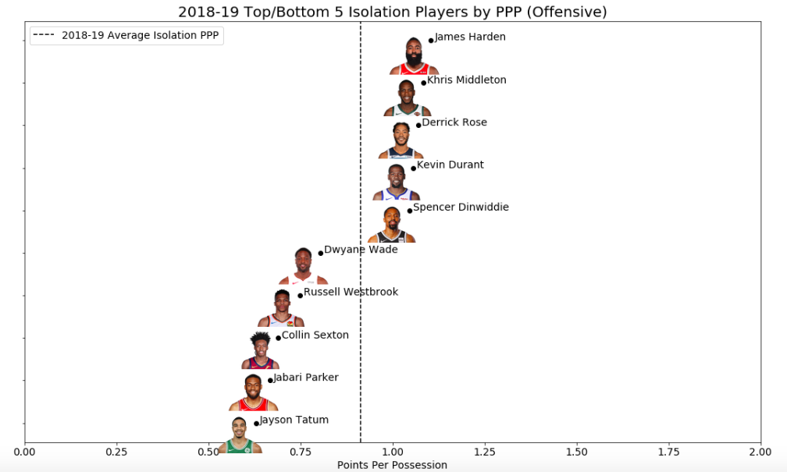
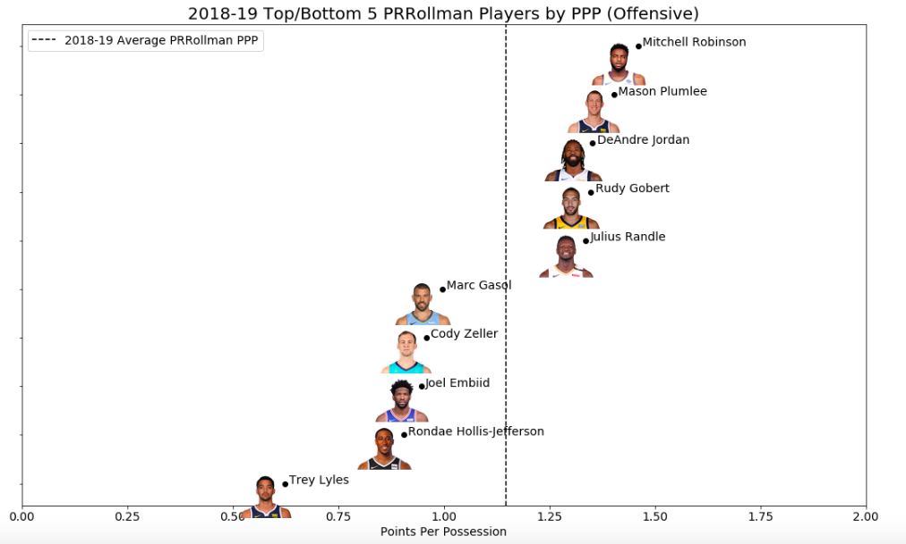

# synergy
NBA Synergy data exploration

## Description

This repo contains a notebook (`synergy_exploration.ipynb`) that explores the `synergyplaytypes` endpoint of the [stats.nba.com](https://stats.nba.com) API. With the `Synergy` and `Headshot` classes of the `py_ball` package, the available features are explored and a points-per-possession visualization is built for top and bottom season performers.

## Results

The following shows the top and bottom performers on isolation plays for the 2018-19 regular season. The best (James Harden) and worst (Jayson Tatum) players are no surprise here given the narrative surrounding each of their seasons.

Here's another visualization for the top and bottom performers as the roll player on pick and roll plays. This list generally makes sense as the bottom performers seem like a slower and less athletic group compared to the top performers.

